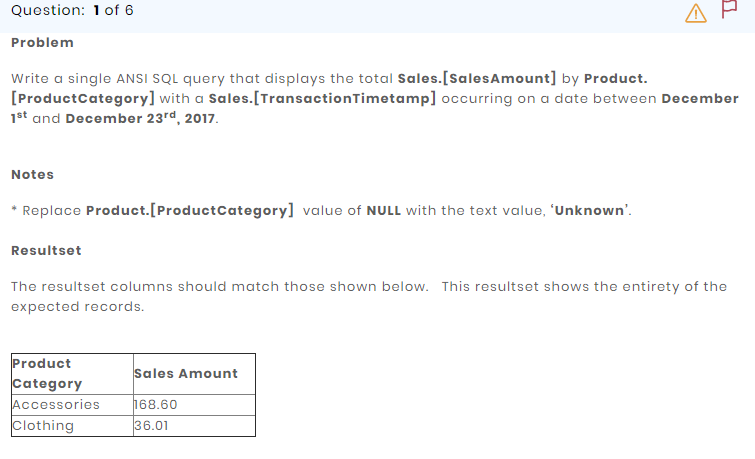
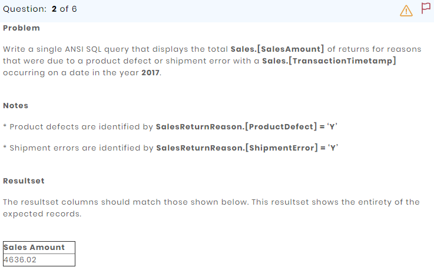
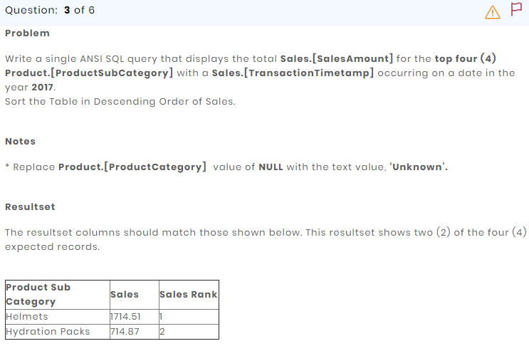
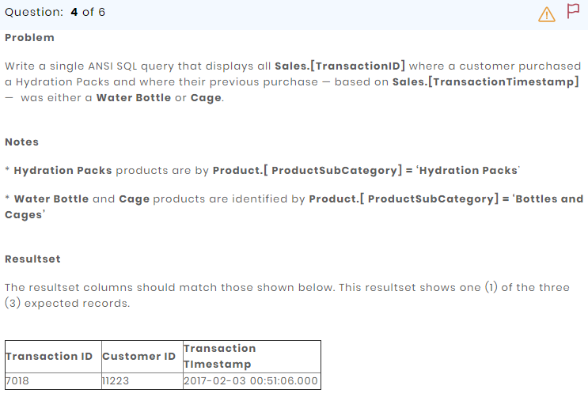
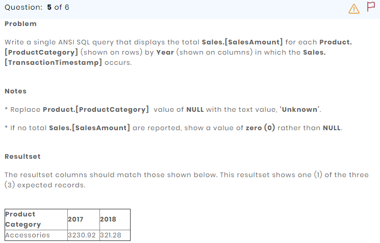
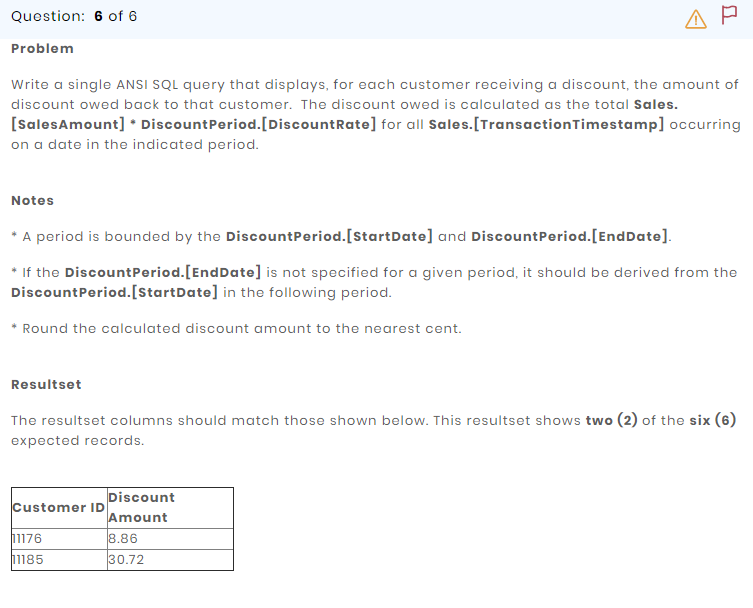

# Problem 1



```SQL
select 
    isnull(p.ProductCategory, 'Unknown') as "Product Category",
    cast(sum(s.SalesAmount) as decimal(5, 2)) as "Sales Amount"
from Product p, Sales s
where p.ProductId = s.ProductId 
    and s.TransactionTimestamp between '12/01/2017' and '12/23/2017'
group by ProductCategory
```

# Problem 2



```SQL
/*
    Note: I found an issue here. The expected result that is shown on the left,
    `4636.02` is for all of the sales for the year 2017. I got that result when
    I just filtered by year without figuring in the return reasons:
    
	select cast(sum(s.SalesAmount) as decimal(5, 2)) as "Sales Amount"
	from Sales s
	where year(s.TransactionTimestamp) = '2017'
*/

select cast(sum(s.SalesAmount) as decimal(5, 2)) as "Sales Amount"
from Sales s
where year(s.TransactionTimestamp) = '2017'
    and s.TransactionId in (
	    select srr.TransactionId
	    from SalesReturnReason srr
	    where srr.ProductDefect = 'Y' or srr.ShipmentError = 'Y'
	    group by srr.TransactionId
	)
```

# Problem 3



```SQL
select top 4
    isnull(p.ProductSubCategory, 'Unknown') as "Product Sub Category",
    cast(sum(s.SalesAmount) as decimal(6, 2)) as "Sales",
    row_number() over (order by sum(s.SalesAmount) desc) as "Sales Rank"
from Product p, Sales s
where p.ProductId = s.ProductId 
    and year(s.TransactionTimestamp) = '2017'
group by p.ProductSubCategory
order by 2 desc
```

# Problem 4



```SQL
select
    main.TransactionId as "Transaction ID",
    main.CustomerId as "Customer ID",
    convert(nvarchar, main.TransactionTimestamp, 121) as "Transaction Timestamp"
from (
    select 
        s.TransactionId, s.CustomerId, s.TransactionTimestamp,
        p.ProductSubCategory,
        lag(p.ProductSubCategory, 1, Null)
		over (partition by s.CustomerId order by s.TransactionTimestamp) as "PreviousPurchase"
    from Sales s, Product p
    where s.ProductId = p.ProductId
) main
where main.PreviousPurchase = 'Bottles and Cages' and main.ProductSubCategory = 'Hydration Packs'
```

# Problem 5



```SQL
/*
    Note: this can also be done dynamically instead of hard-coding the columns.
*/

select 
    pvt."Product Category",
    isnull(pvt."2017", 0) as "2017",
    isnull(pvt."2018", 0) as "2018"
from (
    select 
        isnull(p.ProductCategory, 'Unknown') as "Product Category",
        year(s.TransactionTimestamp) as Year,
        cast(sum(s.SalesAmount) as decimal(6, 2)) as "Sales Amount"
    from Product p, Sales s
    where p.ProductId = s.ProductId 
    group by ProductCategory, year(s.TransactionTimestamp)
) main
pivot (
    sum(main."Sales Amount")
    for main.Year in ("2017", "2018")
) pvt
```

# Problem 6



```SQL
;
with dp as (
    select 
        dp.CustomerId,
        dp.StartDate,
        lead(dp.StartDate, 1, dp.EndDate)
		over (partition by dp.CustomerId order by dp.StartDate) as EndDate,
        dp.DiscountRate
    from DiscountPeriod dp
)
select 
    s.CustomerId as "Customer ID",
    cast(round(sum(s.SalesAmount * dp.DiscountRate), 2) as decimal(4, 2)) as "Discount Amount"
from Sales s, dp
where s.CustomerId = dp.CustomerId
    and s.TransactionTimestamp between dp.StartDate and isnull(dp.EndDate, getdate())
group by s.CustomerId
```